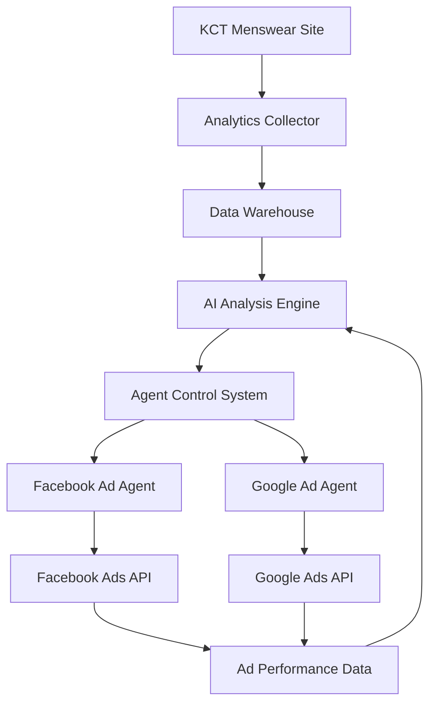

# AI Analytics & Agent Integration Setup

## 1. Project Data Sources

### Shopify Data (Available)
- Store domain: `kctmenswear.myshopify.com`
- API Version: `2024-01`
- Access Token: `427f1f7008ce480a2b33b9d99b6ff65c`
- Available data:
  - Product catalog
  - Order history
  - Customer data
  - Inventory levels
  - Collections

### Analytics Data (Available)
- Google Analytics 4
  - Measurement ID: `G-LH26GTWFQS`
  - Container ID: `GT-NS83N5B`
- Facebook Pixel
  - Pixel ID: `283546658844002`
- Google Ads
  - Conversion ID: `961362501`
  - Remarketing ID: `961362501`

## 2. Required API Credentials

### Facebook Marketing API
```env
FACEBOOK_APP_ID=your_app_id
FACEBOOK_APP_SECRET=your_app_secret
FACEBOOK_ACCESS_TOKEN=your_access_token
FACEBOOK_AD_ACCOUNT_ID=your_ad_account_id
```

### Google Ads API
```env
GOOGLE_ADS_CLIENT_ID=your_client_id
GOOGLE_ADS_CLIENT_SECRET=your_client_secret
GOOGLE_ADS_DEVELOPER_TOKEN=your_developer_token
GOOGLE_ADS_REFRESH_TOKEN=your_refresh_token
GOOGLE_ADS_CUSTOMER_ID=your_customer_id
```

### OpenAI API (for AI Agents)
```env
OPENAI_API_KEY=your_openai_api_key
OPENAI_ORG_ID=your_org_id
```

## 3. Data Integration Points

### Current Analytics Events
Located in `/src/lib/analytics/`:
- Page views
- Product views
- Add to cart
- Checkout events
- Purchase completion

### Current Ad Tracking
Located in `/src/lib/ad/`:
- Facebook Pixel events
- Google Ads conversion tracking
- Custom event tracking

## 4. Required Data Access

### Product Data
```typescript
interface Product {
  id: string;
  name: string;
  description: string;
  price: number;
  images: string[];
  category: string;
  sizes: string[];
  colors: string[];
  inStock: boolean;
  handle?: string;
  variantId?: string;
}
```

### Order Data
```typescript
interface Order {
  id: string;
  items: CartItem[];
  total: number;
  customer: {
    id: string;
    email: string;
  };
  shipping: {
    address: string;
    city: string;
    state: string;
    country: string;
  };
  status: string;
  createdAt: string;
}
```

### Customer Data
```typescript
interface Customer {
  id: string;
  email: string;
  firstName: string;
  lastName: string;
  orders: Order[];
  totalSpent: number;
  lastPurchase: string;
}
```

## 5. Integration Architecture

### API Endpoints to Create
1. Analytics Data Endpoint
```typescript
POST /api/analytics/events
GET /api/analytics/metrics
GET /api/analytics/reports
```

2. Ad Management Endpoints
```typescript
POST /api/ads/facebook/create
POST /api/ads/google/create
GET /api/ads/performance
PUT /api/ads/budget
```

3. Agent Control Endpoints
```typescript
POST /api/agents/facebook/analyze
POST /api/agents/google/analyze
GET /api/agents/recommendations
PUT /api/agents/actions
```

### Webhook Setup
1. Shopify Webhooks
```typescript
POST /webhooks/shopify/orders/create
POST /webhooks/shopify/products/update
POST /webhooks/shopify/inventory/update
```

2. Ad Platform Webhooks
```typescript
POST /webhooks/facebook/ads
POST /webhooks/google/ads
```

## 6. Agent Requirements

### Facebook Ad Agent
- Access to:
  - Product catalog
  - Sales data
  - Customer segments
  - Ad performance history
  - Budget limits
  - Creative assets

### Google Ad Agent
- Access to:
  - Search term performance
  - Product feed
  - Conversion data
  - Campaign structure
  - Budget allocation
  - Keyword performance

### Shared Agent Requirements
- Performance monitoring
- Budget management
- A/B testing capabilities
- Audience targeting
- Creative optimization
- ROI tracking

## 7. Data Flow Architecture



## 8. Implementation Steps

1. Set up data collection pipeline
2. Implement API authentication
3. Create data warehouse structure
4. Build AI analysis engine
5. Develop agent framework
6. Implement platform-specific agents
7. Create monitoring dashboard
8. Set up alerting system
9. Deploy agent infrastructure
10. Begin supervised learning phase

## 9. Security Requirements

1. API Security
- OAuth 2.0 authentication
- Rate limiting
- Request validation
- API key rotation
- IP whitelisting

2. Data Security
- Encryption at rest
- Encryption in transit
- Access logging
- Audit trails
- Data retention policies

3. Agent Security
- Action limits
- Budget constraints
- Approval workflows
- Activity logging
- Error handling

## 10. Monitoring Requirements

1. Performance Metrics
- Response times
- Error rates
- CPU usage
- Memory usage
- Network latency

2. Business Metrics
- ROAS (Return on Ad Spend)
- CPA (Cost Per Acquisition)
- CTR (Click-Through Rate)
- Conversion rates
- Revenue impact

3. Agent Metrics
- Decision accuracy
- Budget efficiency
- Learning rate
- Error recovery
- Action success rate

## 11. Connection Points in Current Project

### Analytics Integration
File: `/src/lib/analytics/engine.ts`
```typescript
// Add new method for AI analytics
interface AIAnalyticsData {
  eventType: string;
  timestamp: string;
  data: any;
}

async function sendToAIAnalytics(data: AIAnalyticsData) {
  // Implementation
}
```

### Ad Platform Integration
File: `/src/lib/ad/index.ts`
```typescript
// Add new methods for AI agent control
interface AdAgentAction {
  platform: 'facebook' | 'google';
  action: string;
  parameters: any;
}

async function executeAgentAction(action: AdAgentAction) {
  // Implementation
}
```

### Performance Monitoring
File: `/src/lib/performance/monitor.ts`
```typescript
// Add AI agent performance tracking
interface AgentMetrics {
  agentId: string;
  action: string;
  result: any;
  performance: {
    duration: number;
    success: boolean;
    metrics: Record<string, number>;
  };
}

function trackAgentPerformance(metrics: AgentMetrics) {
  // Implementation
}
```

## 12. Next Steps

1. Create new repository for AI analytics backend
2. Set up development environment
3. Implement data collection pipeline
4. Create agent framework
5. Build platform-specific agents
6. Develop monitoring dashboard
7. Set up secure communication
8. Begin testing phase
9. Deploy to staging
10. Monitor and optimize

## 13. Additional Considerations

1. Scalability
- Horizontal scaling capability
- Load balancing
- Caching strategy
- Database sharding
- Message queuing

2. Maintenance
- Backup procedures
- Update processes
- Rollback procedures
- Health checks
- Error recovery

3. Compliance
- GDPR compliance
- CCPA compliance
- Data privacy
- Consent management
- Audit trails

4. Documentation
- API documentation
- Integration guides
- Troubleshooting guides
- Best practices
- Security guidelines